## Sneaking around are you? You little bugger... 

### Have you ever wanted to be a Seeker of many? Let every worthy sacrifice be carved in ice to endure for all time. Such is the price of eternal youth.

I mainly spend my time working with Minecraft (Java) on development with [CrazyCrew](https://github.com/Crazy-Crew).

<!-- START Links -->
[Sponsors]: https://github.com/sponsors/RyderBelserion
[Discord]: https://discord.gg/Gsan8cFrDJ

[Sponsors Badge]: https://raw.githubusercontent.com/intergrav/devins-badges/v2/assets/cozy/donate/ghsponsors-singular_vector.svg
[Discord Badge]: https://raw.githubusercontent.com/intergrav/devins-badges/v2/assets/cozy/social/discord-singular_vector.svg

<!-- END Links -->

## Neat Places:
<table>
  
 <tr>

  <td>

  ### Modrinth
    
  
    
   [Modrinth](https://modrinth.com/), Simply a great platform for mods/plugins.

  </td>
    
  <td>

  ### Hangar
    
  
    
   [Hangar](https://hangar.papermc.io/), A great platform for uploading [paper](https://papermc.io) plugins

  </td>

  <td>

  ### Ryder's Tavern
    
  
    
  [Ryder's Tavern](https://discord.gg/w7yCw4M9za), A personal discord server to just chill in.
    
  </td>

 </tr>
  
</table>

